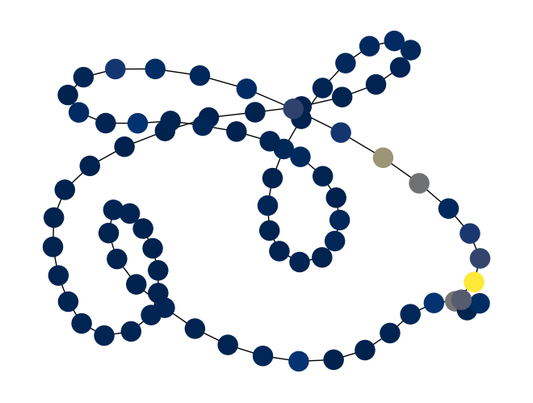
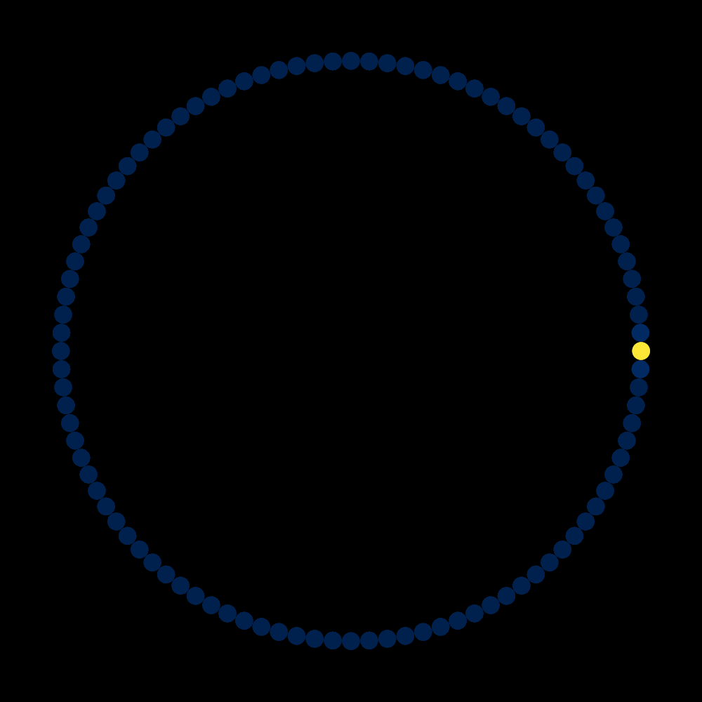
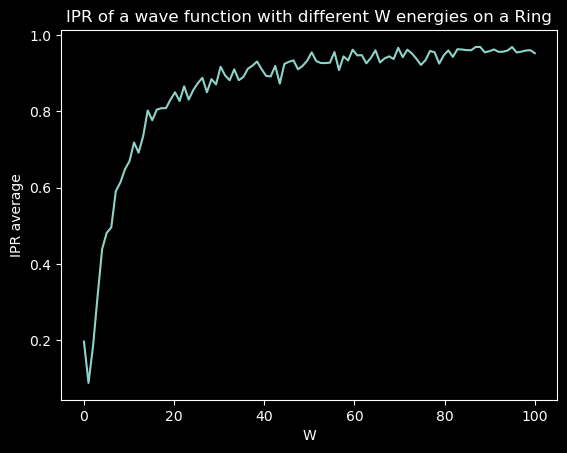
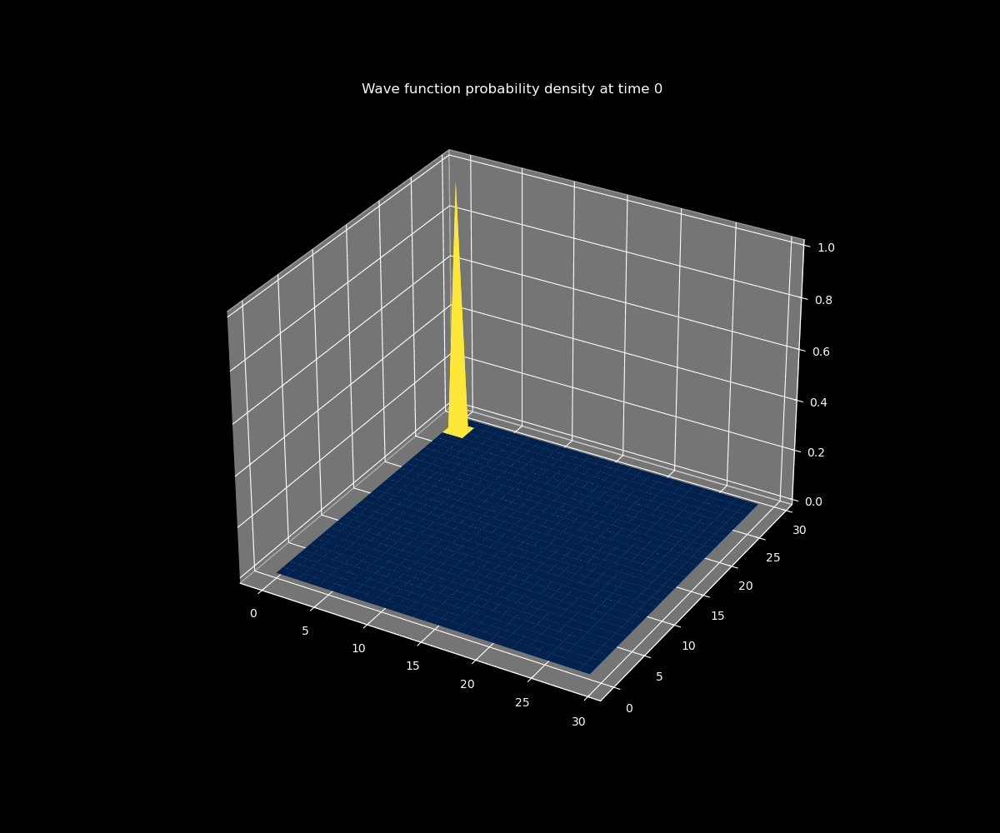
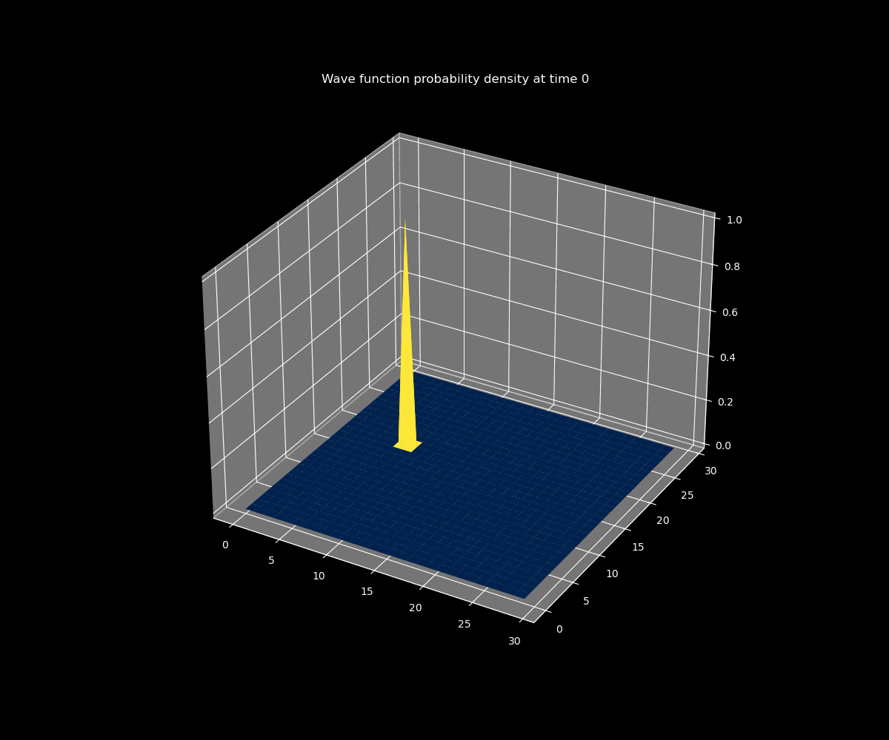
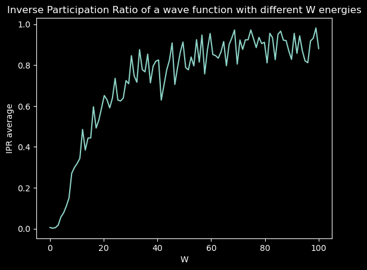
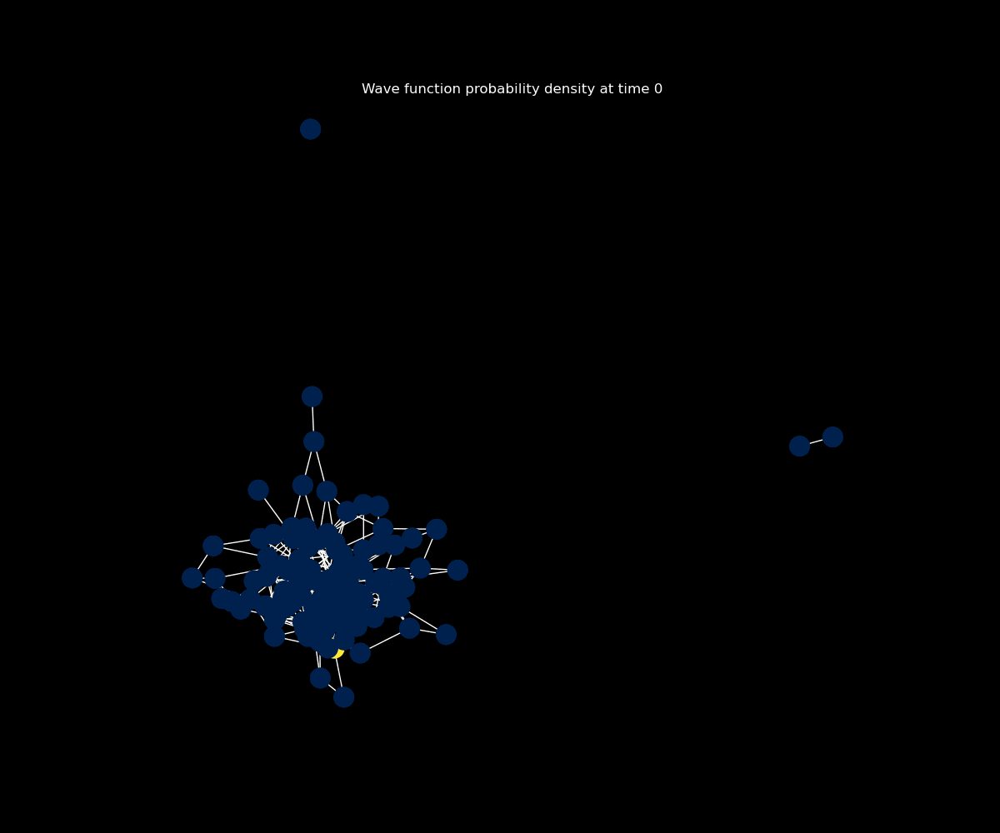
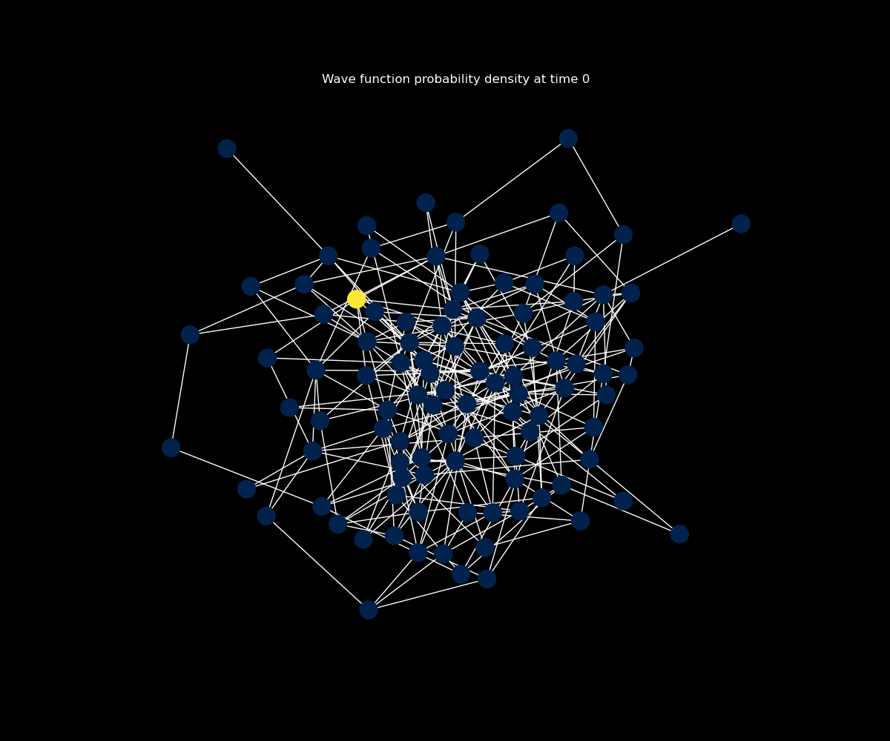
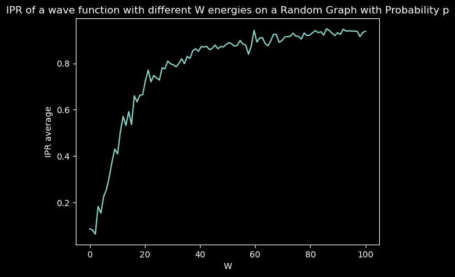

### Created by Ravi Koka, Abby Perryman, Anish Pandya, Patrick Devaney

# Getting Started

To use the notebooks here, create a `conda` environment using *qgraph_env.yml*

Instructions for creating a `conda` environment from a yaml file are located [here](https://conda.io/projects/conda/en/latest/user-guide/tasks/manage-environments.html#creating-an-environment-from-an-environment-yml-file). This will automatically create an `conda` environment named `qgraph`, which you should use as your Jupyter kernel. 

# Introduction
This project implements the tight binding model for an electron on an arbitrary graph structure.

By varying disorder and random parameters, [Anderson Localization](https://en.wikipedia.org/wiki/Anderson_localization) can be demonstrated.

There are interfaces for generating graphs that represent 1D and 2D lattices and for generating [Erdős–Rényi](https://en.wikipedia.org/wiki/Erdős–Rényi_model) random graphs.

There is direct support for calculating the inverse participation ratio (IPR), a measure of locality.

# Numerical Approach

## The Tight Binding Model

An electron can exist in sites $| 1 \rangle , \, | 2 \rangle , \, \ldots , | N \rangle$ (where $N$ is the total number of sites). Different sites have arbitrary connections to each other, with the connections forming a simple graph. This graph can then be represented by an $N \times N$ adjacency matrix.

The state of the electron is denoted $| \psi \rangle$ and is a normalized linear combination of the site states.

## The Tight Binding Hamiltonian

The Hamiltonian for the tight binding model for a single electron can be written as follows:


$$\langle n | H | m \rangle = H_{n,m} = \underbrace{\epsilon \delta_{n,m}}_\textrm{binding} \underbrace{- t(\delta_{n+1,m} + \delta_{n-1,m} )}_\textrm{hopping}$$

where $H$ is the electron Hamiltonian, $\epsilon$ is the binding energy, $\delta$ is the Kronecker delta, and $t$ is the hopping parameter. $n$ and $m$ refer to states associated with a particular site as in the tight binding formalism.

Anderson localization can be demonstrated on this model when the diagonal of the Hamiltonian $H$ is randomized and if values of $\epsilon$ are randomly sampled from a uniform distribution on $[-W, \, W]$ where $W$ is known as the disorder parameter. In this case, larger $W$ correlates with increased localization.

## Time Evolution

The system can be time evolved using the following equation:

$$ | \psi(t) \rangle = \exp(-i H t / \hbar) | \psi(0) \rangle $$

## Inverse Participation Ratio (IPR)
The inverse participation ratio is a measure of locality defined as the sum of the fourth power of the magnitude of the wave function of each site in the lattice. Explicitly,

$$ \textrm{IPR} =  \sum_n |\psi(n)|^4 $$

IPR takes a range of $1 / N$ to $1$, with the former being the least localized and the latter the most.

# Basic Usage
`AndersonGraph.py` contains the `AndersonGraph` class which implements the tight binding model on a graph, with the input graph being a NetworkX graph object.

Multiple code examples can be found in [summary.ipynb](summary.ipynb).

[plotting.py](plotting.py) has functions for plotting states of the graph. [animations.py](utils/animations.py) has functions for generating animations graphs. [plot_ipr.py](utils/plot_ipr.py) has functions for plotting the IPR of a graph. Most of these functions take an `AndersonGraph` object and a few visual parameters.

To create an instance of an `AndersonGraph` object, the constructor takes as arguments a NetworkX graph object (a simple graph), an array of wave functions at each site, a range of values on which $\epsilon$ can be sampled from, and the hopping parameter $t$.

Here is a basic example creating an 80-site 1D ring with $| \psi(0) \rangle$ fully localized at a single site and $W$ = 1, .
```python
import AndersonGraph as ag # The exact form of this may change based on the relative location of AndersonGraph.py

N = 80 # Define number of sites
psi_0 = np.zeros(n)
psi_0[N//2] = 1 # Create wave function

ring = nx.grid_graph(dim=[N], periodic=True) # Create ring

anderson_ring = ag.AndersonGraph(graph=ring, psi_0=psi_0, eps_range=[-1, 1], t_hop=1) # Construct AndersonGraph object

anderson_ring.plot_density(t=17) # Plot the time evolution of the system
```
And here is the plot output:


# Plot and Animation Examples

## 1D Ring
### Diffusive Case
$W$ = 0


### Localized Case
$W$ = 10


### IPR


## Periodic 2D Lattice
### Diffusive Case
<!--

-->
$W$ = 0


### Localized Case
$W$ = 10


### IPR 


## Random Graph
### Diffusive Case
$W$ = 0


### Localized Case
$W$ = 100


### IPR



Many example plots and animations can be found in the "plots" folder [here](plots).

# Potential Applications
The basic setup here of allowing an electron to exist in discrete, finite spaces can be applied to some interesting quantum mechanical systems. A non-exhaustive list of applications is given below.

1. **Anderson Localization**: This project can be used to show Anderson localization on graphs.
2. **Quantum Dot Cellular Automata**: A computing paradigm that is an alternative to standard transistor-based computing, based on cellular automata. Encodes information in charges localized in quantum dots.
3. **Many-Body Localization**: Anderson localization can be extended to the localization of many bodies, something thermodynamically interesting.

# Resources

This started as a project for PHY 381C (Computational Physics) at UT Austin ([class website](http://www.wgilpin.com/cphy/)). [Here](resources/Anderson%20Localization.pptx) is a link to a presentation given in-class on this repository, which is provided in case anyone finds it useful. It is also available as a PDF (which precludes animationes) [here](resources/Anderson%20Localization.pdf).

<!-->
A good overview of Anderson Localization by Guan and Guan can be found in the "resources" folder [here](resources/GuanChenguang.pdf).
-->


# Future Directions

1. **Generalize to Many-Body Case**: Our single-electron approach allows for a closed-form solution for the wave function at any point in time. Introducing multiple electrons would necessitate making a choice about iterative and approximate solution methods and would introduce more complex quantum mechanical behaviors.
2. **Introduce Different Boundary Conditions**: Every connection on the graph here behaves as a periodic boundary condition — that is, the electron is free to travel between any node unhindered by reflective, absorptive, or other effects.
3. **Add Graph Directionality and Weight**: Extensions past simple graph structures may be able to realize more complex physical phenomena, inclding transport phenomena and variable site spacing.

# Major Dependencies
This project makes extensive use of [NetworkX](https://github.com/networkx/networkx) for representing graph structures.

# Credits
Special thanks to Dr. William Gilpin (<wgilpin@utexas.edu>), Edoardo Luna (<edoardoluna@utexas.edu>), and Anthony Bao (<abao@utexas.edu>) for such good course instructors.